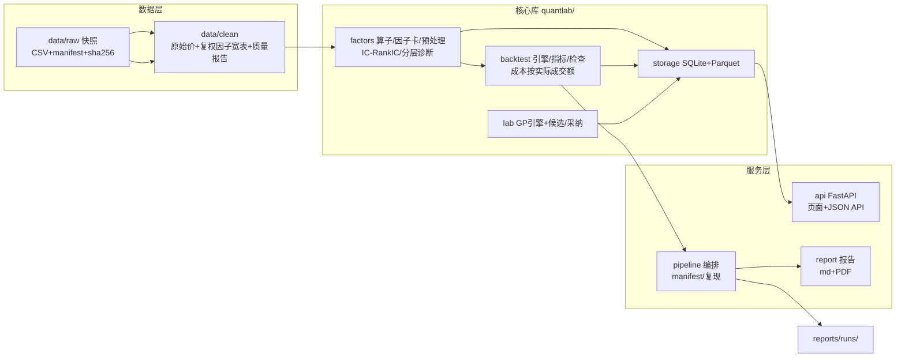

# QuantLab · 量化投研框架（CF2026 Project 1）

> 面向量化研究员的网页端量化投研平台：**数据 → 因子 → 信号（策略）→ 目标组合 → 回测/模拟成交 → 评估与解释**。
> 目标对齐课程 Project 1：**最小但完整、正确、可复现、可扩展**。
> 四模块 Web 平台：**因子库 / 策略（信号）/ 回测 / 算法实验室**，另含 **股票池行情页、组合对照实验页（/experiments）、研究记录页（/runs）、回测对比视图**。
>
> 两条核心抽象：
> - **信号 ≠ 回测**。信号是纯权重输出（由因子按模型组合而来），**可像因子一样做 IC/RankIC/分层诊断**；
>   回测是对信号在「时间区间 × 股票池 × 权重规则 × 成本」下的一次配置化模拟成交。**一个信号可回测多次**。
> - **股票池是逐日 point-in-time 的**。沪深300/中证500/中证1000 的成分按日变化，回测每日只在当日成分内选股。
>
> 产品设计蓝图见 `../量化因子挖掘平台-产品设计方案.md`（本仓库实现其课程复现版）。

---

## 1. 快速开始

> **仓库不含行情数据**。`data/` 实测约 1.6 GB（其中 `data/raw/daily_basic.parquet` 单个 294 MB，
> 超过 GitHub 单文件 100 MB 硬限），已在 `.gitignore` 排除 —— 请按下面第 2 步自己抓。
> **随机附带的只有 `data/reference/`**（PIT 指数成分区间表 + 申万行业区间表 + 交易日历，约 1 MB），
> 它是动态股票池与行业中性化的数据前提，缺了就跑不起来。
> 研究报告正文与图表在 `reports/`（`reports/runs/` 是逐次运行产物，同样不提交）。

```bash
# 1) 依赖（Python >= 3.11；本机实测 3.10.18 亦可运行）
pip install -r requirements.txt

# 2) 抓数据（约 40 分钟，取决于限频）
#    凭证：环境变量 TUSHARE_TOKEN，或写入 .env（已 gitignore，勿提交）
#    默认 pit 模式 = HS300/ZZ500/ZZ1000 在样本期内的 PIT 成分并集（约 2800 只）
python scripts/fetch_data_tushare.py --universe pit --start 20200102 --end 20260925
#    市值/估值（市值中性化、股票池行情页要用）：按交易日整市场拉，比逐股快一个数量级
python scripts/fetch_daily_basic.py  --start 20200102 --end 20260925
#    小样本模式（沪深300 步长抽样 50 只，秒级）：--universe sample
#    备用 akshare/sina 抓取器：python scripts/fetch_data.py
#    5 分钟因子（可选）：面板构建后把 factors_5m.yaml 的卡片登记进因子库
#    （日末快照口径，与日频因子同一诊断/组合/回测链路）
python scripts/register_5m_factors.py

# 3) 一键研究流水线：清洗→质量报告→三因子诊断→回测→对照实验→复现 manifest
python scripts/run_pipeline.py --run-id v1

# 4) 生成研究报告（Markdown + PDF，含图表）
python scripts/build_report.py --run v1

# 5) Web 平台（因子库 / 股票池 / 策略 / 回测 / 算法实验室）
python -m uvicorn quantlab.api.main:app --port 8000
# 打开 http://127.0.0.1:8000

# 6) 组合方式对照实验（同因子集只改组合模型，RankIC/NW t 对照表落盘）
python scripts/compare_combinations.py --factors 1,2,3 --start 2023-01-01 --end 2025-06-30
#    加 --backtest 同时对照各模型的净值表现；--rebalances weekly,monthly 对照调仓频率

# 7) 测试（数据完整性 / 因子正确性 / 回测门禁 / 复现 / 分段防泄漏 / 沙箱 / 组合器）
python -m pytest tests/ -q

# 8) 全页面稳定性巡检（可选，需 Web 服务已启动）
python scripts/check_pages.py --base http://127.0.0.1:8001
```

**改抓取区间是安全的**：跳过逻辑按「上次拉的区间是否覆盖本次请求区间」判断（而不是"文件存在就跳过"），
所以扩区间会重拉、收窄会跳过。基准指数同理 —— 它一旦被误跳过，
`clean.py` 会用陈旧的 benchmark 日期当交易日历，把整个清洗结果**静默截断**回旧区间（踩过）。


## 2. 架构与模块职责



| 模块 | 职责 | 关键接口 | 不做 |
|---|---|---|---|
| `quantlab/data/clean.py` | **ETL 与质检**：逐股 CSV → 宽表面板、去重、非法值计数、停牌/未上市标记、质量报告；**复权在加载时按口径派生**（不落调整价） | `build_clean()`、`MarketData.price(field, basis)` | 不做数据供应商（抓取脚本在 scripts） |
| `quantlab/data/universe.py` | **动态股票池**：PIT 指数成分区间表 → 逐日布尔掩码 | `index_member_mask()`、`resolve_pool()` | 不推断缺失（池外一律 False） |
| `quantlab/data/industry.py` | **PIT 行业分类**：申万区间表 → 逐日标签/分组编码 | `industry_labels()`、`industry_group_codes()` | 不掩盖 2021-12 分类断裂；**区间只从 2020-12-31 起，页面显式提示** |
| `quantlab/data/fundamentals.py` | **市值/估值面板**（Tushare `daily_basic`，单位换算后按日对齐） | `total_mv_panel()`、`snapshot()`、`names()` | 无数据时明确报错，不用别的字段冒充市值 |
| `quantlab/factors/` | 算子注册、因子卡、截面预处理、**IC/RankIC/分层诊断** | `load_cards()`、`compute_factor()`、`run_diagnostics()` | 不做组合与回测 |
| `quantlab/factors/layers.py` | **分层净值**（因子与信号的共同「附属统计量」，随诊断自动产出） | `layered_nav()` | 不建模整手/次日开盘/现金约束（完整版在回测引擎） |
| `quantlab/factors/user_code.py` | **手写因子的受限执行**（模块白名单已真正接线） | `compute_user_factor()`、`load_factor_function()` | 暂无超时/进程隔离（已知） |
| `quantlab/factors/model.py` | **线性/决策树组合器**，walk-forward + purge | `fit_walk_forward()` | 不做全样本拟合（防前视） |
| `quantlab/backtest/engine.py` | **组合执行引擎**：目标权重 → 目标股数 → 逐笔模拟成交 | `run_backtest()`、`target_weights()`、`select_top()` | 不做实盘/撮合细节 |
| `quantlab/backtest/` | 绩效指标、**7 项基本检查（门禁）** | `compute_metrics()`、`run_checks()`、`finalize_checks()` | — |
| `quantlab/lab/` | GP 符号回归 + **AlphaGen-RL（CPU 日频）** 双引擎，三段隔离 | `GpEngine.run()`、`AlphaGenEngine.run()` | AlphaGen 大模型规模需 GPU |
| `quantlab/storage/` | 因子库/**信号**/**回测记录**/股票池/任务元数据（SQLite）+ 因子值（Parquet） | `register_factor()`、`create_signal()`、`run_backtest_for_signal()` | 不承载时序大对象 |
| `quantlab/api/` | Web 四模块页面 + JSON API（202+轮询） | 见 `/docs`（OpenAPI） | 不做计算（重计算在核心库） |
| `scripts/` | 数据获取、流水线入口、报告入口 | `fetch_data_tushare.py`、`run_pipeline.py`、`build_report.py` | — |

## 2.5 因子 → 信号的组合方式（怎么更好地组合）

| 模型 | 权重来源 | 前视纪律 | 适用 |
|---|---|---|---|
| `equal_weight` | 等权 | 无信息使用 | 基线 |
| `ic_weight` | 全样本 RankIC 均值 | ⚠️ 轻微样本内偏误（权重看过全样本），仅作基线 | 快速参考 |
| `ic_weight_rolling` | 滚动 ICIR：w(t) ∝ mean(IC[·<t−h]) / std(IC[·<t−h])，IC 序列 shift(h) 屏蔽前视 | ✅ | **推荐** |
| `ic_inversevol_rolling` | 滚动 IC 逆波动率：w ∝ 1/std(IC[·<t−h])（ICIR 的稳健变体，均值穿零不翻符号） | ✅ | 推荐：IC 估计噪声大时更稳 |
| `ic_meanvar` | IC 均值-方差凸组合 w ∝ (Σ+λI)⁻¹μ（滚动，同样 shift(h)） | ✅ | **推荐**：分散化收益进权重 |
| `ortho_ic_weight_rolling` | 分量顺序 Schmidt 正交化 → 残差滚动 ICIR | ✅ | 因子高度相关时消除重复计价 |
| `linear` / `tree` / `gbdt` | walk-forward 截面回归（训练窗截止 r−h−purge） | ✅ 全部样本外预测 | 非线性交互 |

**组合前体检**：`GET /api/factors/correlation?ids=…` 给出池化相关矩阵与去冗余建议
（|ρ|≥0.8 按 |RankIC| 贪心剔除）；signals/new 页选中因子自动渲染热力图。
**组合增益**：信号详情页展示组合 vs 最强单因子的同口径 RankIC 对照、分量相关性摘要、
Newey-West 修正 t（重叠标签纪律）；组合"翻正"时如实提示增益比例不适用。
**增量 IC 体检**：`/api/factors/incremental-ic?ids=…` —— Schmidt 正交化分解，
按选择顺序给出各因子的增量 RankIC（排后面的只保留前面解释不掉的信息），
signals/new 页相关性区块联动展示。
**一键对照实验**：`python scripts/compare_combinations.py --factors 1,2,3 --start … --end …`
同因子集只改组合模型，输出 RankIC/普通 t/NW t 对照表并落盘 JSON。

## 3. 关键口径（正确性）

- **复权**：乘法累计因子，`P_adj(t) = P_raw(t) × a(t)/a(τ)`，τ=样本首日；原始价与因子分别保存，不拼接不同参考日片段。
- **因子方向**：统一"分数越高，预期收益越高"（rev5/lowvol20 在公式内取负号）。
- **诊断**：`IC(h)_t = Corr(f_{i,t}, y_{i,t}^{(h)})`；RankIC 为 Spearman（并列平均秩）；截面样本 <10 或常数序列**记缺失不改 0**（IC 与分层两条路径**共用同一最低样本纪律**）；分层收益组内等权、标签缺失报原组/有效人数不重新分组；重叠标签为描述性结果不复利。
- **组合执行**（本版重写）：
  1. t 日收盘在**当日股票池**内按分数取 top_n → 按 `weighting` 分配目标权重，合计 = `target_exposure`（默认 0.98，留现金缓冲）
  2. **目标股数 = nav⁻ × w_i / (价格_i × (1 + 费率_i))**，再按 `lot_size`（默认 100 股）向下取整
     —— 费率在**权重→股数换算时就计入**，因此下单决策不依赖累计现金
  3. 先卖（含**减仓**，真正调平到目标）→ 再买，**逐笔模拟真实现金流**（不做代数省略）
  4. 成交价 t+1 开盘；停牌/缺价当日不可成交，顺延不补并留痕
  5. 回测以**真实资金规模**运行（`initial_cash`，默认 100 万），整手与费用才有意义；展示时净值归一到 1
- **成本**：`Cost_t = c_b·B_t + c_s·S_t` 按实际成交金额，**未成交不扣费**；换手 `(B_t+S_t)/V⁻_t`（V⁻ = 交易前组合总值）。
  > ⚠️ **已知局限**：当前费率是"综合单边费率"（默认买卖各 0.15%），**尚未分项建模印花税（卖出单边）/过户费/经管费**，也未建模样本期内的税率变动。修正前不应当作精确成本结论。
- **显著性纪律（Newey-West）**：h 期标签的 IC 序列天然自相关（相邻两天共享 h−1 天价格），
  普通 t 检验虚高。诊断并列给出 `t_stat`（普通）与 `t_stat_nw`（HAC，lag=h−1），
  组合增益报告重算组合 IC 的 NW t —— 诚实并列，不替你下结论。
- **波动率目标（可选，只降不升）**：`portfolio.vol_target` + `vol_window`（默认 60 日）。
  每个调仓日按 min(1, 目标/已实现) 缩放基准仓位。只降不升的原因：升仓需融资杠杆而
  引擎约束现金非负。实测（×8 高波动市场 + 10% 目标）显著压低已实现波动。
- **行业中性（可选）**：`industry_neutral: true` 时选股按申万 PIT 行业设单行业上限
  ceil(top_n/10)；「未知」组同样受限，不留后门。
- **成本分项**：`cost.stamp_duty_sell`（卖出单边印花税，默认 0.05%，即 2023-08-28 起
  的 A 股口径；此前 0.1% 的时间变动未建模）。逐笔账本分项 commission/stamp_duty，
  门禁按同口径逐笔重算，metrics 输出分项合计。
- **策略相似度**：`GET /api/signals/{id}/similarity` —— 新信号与既有信号的日收益
  重叠区间相关；|ρ|≥0.9 标记"重复"（同一敞口的重复计价，组合不掉风险只放大成本）。
  口径为信号分值面板截面均值日收益（相似度专用，非策略收益）。
- **IC 衰减与半衰期**：`factors/decay.py` + `/api/factors/{id}/decay` —— 多持有期
  RankIC 曲线、半衰期（|IC| 首次减半的 h）、最优持有期与调仓频率提示；
  因子列表含「近60日 RankIC」监控列（近期 vs 全期）。
- **调仓频率建议**：回测新建页选择信号后，自动按信号分量最短半衰期给出频率建议
  （`/api/signals/{id}/rebalance-hint`）；信号详情页同时展示【组合信号】自身的
  最优持有期（`/api/signals/{id}/best-horizon`，多持有期衰减分析）。
- **落地导出**：walk-forward 信号的权重矩阵 CSV（`/api/signals/{id}/weights.csv`，
  Σ|w|=1，t 日只用 t−h 前信息）与最新交易日信号截面 CSV
  （`/api/signals/{id}/latest.csv`，code/score/date）—— 直接可用于实盘/复盘系统。
- **组合对照实验 Web 化**：/experiments 页勾选因子一键跑六模型对照（含
  IC 逆波动率稳健变体），可勾选
  「同时对照净值回测」；历史实验卡片含净指标矩阵、「导出 CSV」与「一键复跑」；
  `--pool` 支持股票池维度对照；`--rebalances` 支持调仓频率矩阵。
- **最新截面 / 权重导出**：`/api/signals/{id}/latest.csv?date=YYYY-MM-DD`（任一
  交易日信号截面）与 `/api/signals/{id}/weights.csv`（walk-forward 全期权重）——
  策略落地与复盘直接可用。
- **run 间差异对比**：`/api/runs/diff?a=&b=` 逐键对比两个 run 的 manifest
  （配置/环境/数据口径），复现排查利器。
- **回测对比视图**：/backtests 列表勾选多条 → `?ids=` 并排对照（共同交易日对齐、
  指标并排、配置差异摘要、毛净值虚线）。
- **基准相对指标**：回测指标含 `vs_benchmark` 组 —— 超额年化（算术+几何）、Beta、
  年化 Alpha（CAPM）、跟踪误差、信息比率、日胜率（对齐日收益计算，公式见
  `metrics.py` 模块头）；详情页卡片行 + 对比页并排行，基准方差为 0 时如实显示 —。
- **月度收益热力图**：回测详情页年×月净收益矩阵（ECharts），附盈利月占比与逐年收益
  —— 收益的时间聚集性一图可见（靠个别月份行情还是均匀赚钱）。
- **对照实验聚合总览**：/experiments 顶部跨实验统计卡（实验数/累计模型数/NW 显著
  模型数/平均方向一致性）—— 换因子集后方向是否稳定，过拟合的第一道信号；
  只做汇总展示，不参与择优。
- **组合报告导出**：信号详情页组合增益报告可导出 PDF（`/api/signals/{id}/report.pdf`）
  与 CSV；对照实验结果页「导出 CSV」；研究记录页实验汇总 CSV。
- **信号滚动 IC 稳定性**：`/api/signals/{id}/rolling-ic` 滚动窗口 RankIC 序列 +
  正负区间占比，信号列表页相似度矩阵热力图（|ρ|≥0.9 重复计价预警）联动。

- **毛净归因口径**：**分别重跑回测**（费率置零）。目标股数按交易前净值换算，而付过手续费后净值本就不同，故两条序列的**仓位规模必然不同**，`checks.gross_net_attribution` 如实量化差异。**毛净差额 = 费用 + 路径差异，不作纯费用归因**。
- **停牌判定**：按**原始收盘价与成交量**判定（`volume<=0` 或原始收盘缺失），不使用复权价。
- **模型类信号（线性/树）**：**walk-forward** 拟合 —— 每个拟合点只用之前的数据，训练集截止 `r − label_horizon − purge`（标签须在预测起点之前完全可观测）；输出的信号面板**全部是样本外预测**。因子值覆盖不到所需历史时**拒绝构建并说明原因**，不给错结果。
- **回测基本检查**（每次自动执行，`checks.gates` 列出全部门禁项）：
  - 净值↔日收益一致性（以发布的 `daily_return` 连乘反推净值，容差 1e-8）
  - 累计收益独立核对（nav 首尾 / daily_return 连乘 / metrics 输出**三源互证**）
  - 交易成本（按配置费率**逐笔重算**后与账本比对，相对容差 1e-9）
  - 权重+现金守恒（逐日 `invested + cash = nav`）
  - **现金非负**（手续费须在下单时预留，不得隐性融资）
  - **无前视**（成交日=形成日次一交易日；买入标的须在当日目标内，**目标集合由信号面板独立重算**含股票池；**卖空/幽灵卖出按重放持仓校验**）
  - **整手一致性**（买入股数须为 `lot_size` 整数倍）
  - 说明：`events_logged`、`gross_net_attribution`、`output_hash` 为**信息项**，不带 `pass` 字段、不参与 `all_pass`；`all_pass` 只统计显式声明门禁的项，缺 `pass` 字段不再默认通过。

## 4. 可复现

- 数据：`data/raw/manifest.json` 登记下载时间、数据源与接口、抽样规则与**逐文件 sha256**（`tests/test_repro.py` 校验）。
  - 主源 **Tushare**（`scripts/fetch_data_tushare.py`）：`index_weight` 取沪深300成分快照、`daily` 未复权行情、`adj_factor` 复权因子、`daily_basic` 换手率、`index_daily` 基准。
    单位换算：`vol` 手×100=股、`amount` 千元×1000=元、`turnover_rate` %÷100=比例；OHLC 与 sina 逐值一致。
  - 备用源 akshare/sina（`scripts/fetch_data.py`）：原始快照备份在 `data/raw_akshare_backup/`。
  - **注意**：Tushare 的 `adj_factor` 精度为 2–4 位小数（sina 为 6 位），复权价存在 ~1e-4 量级差异，故两源结果不完全相同。
- 代码：每次运行把全部源文件 sha256 写入 `reports/runs/<id>/manifest.json.code_version`。
- 配置：`configs/*.yaml` 快照存 manifest；实验只通过 override 改一个因素。
- 验证：两次独立运行的全部结果文件 sha256 一致（已在开发中实测：backtests/factors/experiments/quality 均字节级相同）；单因子回测重跑哈希有测试断言。

## 5. 与课程要求的对照

见 [`docs/PROJECT1_CHECKLIST.md`](docs/PROJECT1_CHECKLIST.md)——逐项映射 CF2026_Project1.pdf 的每个要求 → 实现文件 → 验证产物。

## 6. 自主拓展（超出课程基础部分）

| 方向 | 实现 | 验收证据 |
|---|---|---|
| 数据工程 | 幂等快照导入（manifest 校验值去重）、清洗缓存（parquet）、停牌/未上市区分 | `fetch_data.py --force` 重复导入不重复；`tests/test_data_clean.py` |
| 因子研究工具 | **因子库**（注册/去重/批量诊断/标签）、**手写代码建因子**（沙箱化执行）、**每个因子一套可编辑的预处理+评估参数**（见下节）、**每个因子带计算区间与股票池**（可批量重算并延长区间；换池需显式确认，因截面一变因子含义即变） | Web `/factors`（列表页批量重算）、`/factors/{id}`（参数编辑）；`register_user_factor()`、`batch_refresh_factors()` |
| 自动因子挖掘 | **算法实验室**双引擎：① GP 符号回归（锦标赛+子树交叉变异，适应度=训练段 RankIC）；② **AlphaGen-RL（CPU 日频）**——GRU 逐 token 生成表达式树 + MaskablePPO，奖励=线性因子池 ensemble IC。任务异步化（202+轮询），候选 train/valid/test 三段诚实展示；**因子池自动以隐藏因子入库并落成带学习权重的策略**，也可人工精选采纳（转为可见） | Web `/lab`；端到端实测：GP 任务→7 候选→采纳 3 条；AlphaGen 任务→7 候选（**逐候选三段 IC 各不相同**）→采纳 3 条，落库为 `operator=user`（沙箱代码路径） |
| 组合与风险 | **信号/回测拆分**：信号等权/IC 加权/线性/决策树（另加 `weighted` 用于挖掘因子池的学习权重），自带 IC/分层诊断；回测可配区间/股票池/权重/费率/初始资金；**分层净值**（K 层曲线）作为诊断的附属统计量自动产出，因子页与策略页**共用同一实现与同一图表块** | Web `/signals`、`/backtests`；`create_signal()`、`run_backtest_for_signal()`、`layered_nav()` |
| 动态股票池 | HS300/ZZ500/ZZ1000 逐日 **point-in-time** 成分（区间表 4,033 段，往返自检通过）+ 申万 PIT 行业；**独立的股票池行情页**（成分表 / 等权指数走势 / 个股 K 线抽屉） | Web `/pools`；`quantlab/data/universe.py`、`industry.py`；`data/reference/README.md` |

### 因子参数契约（对齐参考实现 `factor-quant` 的 API）

原始设计文档的生产版接口把因子评估需要的信息拆成一堆扁平参数。本版**逐字段对齐**
那套命名与取值域（对照 `FactorAnalysisPayload` / `BacktestPayload`），
这样两套实现可以并排 diff，不会出现"同一个东西两个名字"：

| 参数 | 参考实现的取值域 | 本版 | 说明 |
|---|---|---|---|
| `fillna_method` | `mean`\|`median`\|`pad`\|`bfill`\|`interpolate`\|`zero` | 同左 **+ `none`** | 参考默认 `mean`；**本版默认 `none`**（保留 NaN，符合本项目"缺失不填零/不推断"的数据纪律） |
| `outlier_method` | `percentile`\|`MAD`\|`3sigma` | 同左 **+ `none`** | 完全一致 |
| `alpha` | 0.01 | 同 | `percentile` 的单侧分位（clip 到 `[alpha, 1-alpha]`） |
| `k` | 3.0 | 同 | `MAD` / `3sigma` 的倍数。**两个参数同时在契约里，由方法决定用哪个** |
| `normalize_method` | `minmax`\|`z_score` | 同左 **+ `rank`**\|`none` | 名称按参考实现用下划线 |
| `ic_method` | `pearson`\|`spearman`\|`kendall` | 同 | 决定报告的**主 IC 口径**；RankIC 列固定为 Spearman 作为对照 |
| `quantile` | 5 | 同 | 分层组数 K |
| `n_day` | 1 | `horizons`（如 `5,20`） | 持有期 h，本版支持一次算多个并分别落库 |
| `adjust` | `''`\|`qfq`\|`hfq` | **真可选**：`hfq`（τ=样本首日）/ `qfq`（τ=样本末日） | 见下节「复权口径」。落盘的是后复权面板，前复权由 `adj_factor` 精确还原（只差一个每股常数 `k = a(τ首)/a(τ末)`），**不需要重跑清洗、也不需要多落一张价格表** |
| `symbols` | 必填 | `stock_pools` + 因子的 `pool_id` | 参考实现每次请求传标的列表；本版做成可复用的 PIT 股票池实体 |
| `top_n` / `portfolio_method` / `delta` | 5 / `equal_weight` / 20 | `top_n` / `weighting` / `rebalance_freq` | 回测配置 |
| `commission` / `slippage` / `initial_cash` | 0.0015 / 0.001 / 1e6 | 同 | 成本与规模 |
| `merge_method` / `rolling_window` | `ic_weight`\|`rolling_ic` / 60 | `equal_weight`\|`ic_weight`\|`linear`\|`tree` | 多因子合成方式 |

**本版在参考契约之上新增且真正生效的部分**（参考实现里缺失或是 `return factor` 的死代码）：

| 新增 | 参考实现的状态 | 本版 |
|---|---|---|
| `neutralize_method` | `capital_neutralize` / `industry_neutralize` 函数体第一行就是 `return factor`；payload 里**没有这个字段**，任务里也从未调用 | `none`\|`industry`\|`industry_resid`\|`size`\|`industry_size`，用 PIT 申万行业 + Tushare `daily_basic` 总市值，**实测生效**（动量 RankIC20：未中性化 −0.0598 → 行业中性 −0.0420 → 行业+市值 −0.0386） |
| `min_n` | 无此参数 | 最低截面/组内有效样本；不足当日记 NaN，不静默算出噪声值 |
| `industry_level` | 固定单一层级 | `sw1`/`sw2`/`sw3` 可选 |

参数**随因子保存在 `factors.preprocess`**，因此「页面写的口径」与「实际算的口径」
永不可能不一致（历史 bug：诊断读全局 `factors.yaml`，页面却按因子声明的口径展示）。

**数据补充**：市值/估值字段由 `scripts/fetch_daily_basic.py` **按交易日整市场**拉取
（每个交易日 1 次请求，而非逐股一次 —— 少一个数量级），产出 `data/raw/daily_basic.parquet`，
含 `total_mv`、`circ_mv`、`pe_ttm`、`pb`、`turnover_rate` 等，
同时供市值中性化与「股票池行情页」使用。**没有数据时相关方法明确报错，不用别的字段冒充市值。**
确切行数/代码数/日期范围见 `data/raw/daily_basic_manifest.json`（不在仓库内，抓完自动生成）。
逐股 CSV 里的 `turnover` 列默认不拉（没有任何下游使用），该字段以本文件为准。

### 复权：清洗层不落调整价，口径在加载时算

**先纠正一个容易混的说法**：`data/clean/` 那个"清洗层"做的是 raw → 宽表面的 **ETL 与质检**
（约 2800 个逐股 CSV 拼成 (交易日 × 股票) 面板、去重、非法值置 NaN 并计数、区分未上市/停牌、产出质量报告与内容哈希），
**它不做复权**。

原实现把 `{open,high,low,close}_adj.parquet` 落盘，等于**把派生结果当存储结果**：
调整价是纯派生量 `P_adj(t) = P_raw(t)·a(t)/a(τ)`，而 `τ` 是口径参数 —— 落盘就把某一个 τ 焊死在数据里，
换口径得重跑清洗。现在改为：

    落盘：{open,high,low,close}_raw.parquet（原始未复权价）+ adj_factor.parquet
    加载：P_adj(t) = P_raw(t)·a(t)/a(τ)，   τ = a 的首个有效值（hfq）/ 末个有效值（qfq）

因为是同一套数、同一运算顺序，派生结果与原来落盘的面板**逐值完全一致（最大绝对差 0.000e+00）**，
所以因子哈希与全部回测结果不变（复跑 pipeline 实测：`mom20` 哈希仍是 `4b04a50b`，
年化 `-28.99%` / MDD `82.63%` 与改前一致）。同时 `data/clean` 体积下降约 30%，
且不再有任何"派生状态"需要同步。

任意 τ（含任意中间基准日）都能零成本还原，不需要多存价格表。入口：
`MarketData.price(field, basis)` / `fields_for(basis)` / `basis_view(basis)`，
回测引擎通过 `basis_view` 注入口径而无需改签名。

**口径影响到什么（实测，不是推断）**：

| | 结果 |
|---|---|
| 日收益率 hfq vs qfq | 最大差 `2.2e-16` —— **完全相同** |
| 比值型因子（20日动量）IC | `-0.03480412` / `-0.03480412`，**差 0** |
| 价格水平型因子（直接取收盘价）截面秩相关 | `0.9808`，2393 只里 **2378 只排名改变** |
| 固定资金下的整手股数 | 2393 只里 **1868 只**不同 |

即：**比值/排序型因子的诊断不受口径影响，价格水平型因子与整手取整会受影响**。
页面的参数表把这条写在 `adjust` 旁边，避免让人以为换个口径什么都会变。

**顺带修掉两个隐患**：
- `vwap = amount/volume` 得到的是**未复权**价，原实现直接放进 `fields`，导致同一张 `fields` 里
  OHLC 是复权价、`vwap` 是原始价（AlphaGen 特征 5 = vwap 等于混用两个尺度）。现在 `vwap` 与 OHLC 同口径。
- 清洗产物带 `clean_version`，结构变了旧缓存自动失效；同时 `build_clean` 会**删除上一版本残留的产物**，
  `MarketData` 缺 `{f}_raw.parquet` 时**明确报错**而不是回退去读任何"看起来像价格"的旧文件 ——
  静默读旧口径的面板会让"复权方式"这个参数变成谎话。

### 长任务与并发：不要把 CPU 活放在请求里

| 操作 | 耗时量级 | 执行方式 |
|---|---|---|
| 页面渲染 / JSON API | 毫秒~秒 | 普通 `def` 端点 → Starlette 线程池 |
| 单因子保存参数（IC + 分层净值重算） | ~10 s | `async def` + `run_in_threadpool` |
| 批量重算 N 个因子 | 10 s × N | **后台线程 + 轮询进度页**（`/jobs/{id}`） |
| 批量删除 | 秒级 | 同上 |
| GP / AlphaGen 挖掘 | 秒~分钟 | 后台线程 + 轮询（`AlgoTask`） |

修复过的真实缺陷：三个 `async def` 端点里**直接调用同步重活**，会把整个事件循环占死 ——
期间连静态文件都无人处理。实测修前一次单因子保存就是全站冻结 ~10 s；
改后同一操作仍在跑时，`/factors` 探针最大响应 0.89 s、均值 0.11 s。

诚实的边界：`run_in_threadpool` 只解决"冻结"，不解决"抢 CPU"。Python 的 GIL 意味着
线程里的 CPU 密集计算仍会拖慢同进程的其它请求（探针从 ~0.02 s 涨到 ~0.89 s）。
要真正隔离需要独立进程/worker 队列（生产版即 Celery），本课程版不做，
但**不会出现"一个长任务把服务完全卡死"**这种情况。

批量任务走 `batch_jobs` 表：提交立即 303 到进度页，页面轮询 `/api/jobs/{id}`，
完成后跳结果页（复用批量结果模板）。单个因子失败不影响其余，结果页同时列出成功与失败项。

### 挖掘任务：因子池直接落成策略（隐藏因子）

AlphaGen 的产物本来就是一个**线性因子池**（`AlphaPool` 在训练中学到归一化权重），
所以任务成功后自动做两步：

1. 池内因子以**隐藏因子**入库（`factors.hidden=1`）——照常计算与诊断，只是不在
   因子库主列表露出（列表页有「显示隐藏因子」开关）。人工在任务页再点采纳 = 确认，转为可见。
2. 用这些因子 + **算法学到的权重**落成一个策略（`model_type=weighted`）。
   权重带符号（实测学到过 −1.0，即反向使用），所以不能标成 `equal_weight` —— 那会让页面口径说谎。

GP 引擎**不自动落库**：它输出的是一个按适应度排序的种群，没有"池 + 学习权重"这个概念，
自动全采纳只会把因子库灌满。GP 仍是人工挑候选采纳。

### 挖掘任务的计算范围：口径 / 区间 / 股票池只有一个实现

任务的「因子计算参数」与因子页那张参数表同源（`PREPROCESS_SCHEMA`），另加两项计算范围：

| 项 | 作用点 |
|---|---|
| 复权方式 | `MarketData.scoped_view(basis=...)` |
| 起止日期 | 同上，按本地交易日闭区间切（不足 2 天明确报错） |
| 股票池 | 同上，PIT 逐日掩码 → **池外整格 NaN** |

股票池为什么不静态裁代码集：PIT 指数成分逐日变化，裁成"曾经属于过"的并集等于放松池子。
掩码把 `close_adj` 也一起置 NaN，于是**因子求值、标签、IC、GP 适应度、AlphaGen 奖励全在池内算**——
两个引擎共用同一个视图，口径不可能分叉。实测：沪深300 池下缓存有限值占比 12.33%，
与池内格子占比 12.34% 一致。

缓存目录按 `口径_起止_p池内格子数` 分目录，换池或换区间不会误用旧缓存。

**持有期只有一个**：训练目标（AlphaGen `label_horizon` / GP `horizon`）就是那个 h，
它直接决定入库因子的 `spec.horizons`，页面上不给第二个 h 输入框 ——
否则"训练按 5 日、诊断却按 5 和 20 日报"这种口径打架必然出现。

### 挖掘任务的分段：自己定三个区间（或按比例），两个引擎同规则

**两种模式**（任务表单里的「三段切分」）：

| 模式 | 输入 | 说明 |
|---|---|---|
| 按比例自动分 | `train_ratio` / `valid_ratio` | 默认 0.6 / 0.2，测试段取剩余 |
| **自己指定三个区间** | 训练/验证/测试各自的起止日期 | 想填几个填几个，缺的边界按相邻项推 |

显式模式支持只填部分边界（用相邻边界或比例兜底）：
- 只填 `valid_start` + `test_start` → 三个区间全定
- 只填 `train_end` → valid/test 边界按比例兜底
- 只填 `valid_start` + `valid_end` → test 从 valid 结束之后开始

约束会**明确校验并报错**，不静默修正：必须满足
`train_start ≤ train_end < valid_start ≤ valid_end < test_start ≤ test_end`。

**防泄漏（两个引擎同一实现）**：h 期标签 `y(t)=C(t+h)/C(t)-1` 要用到 `t+h` 的价格，
所以每段末尾 h 个形成日的标签会落在下一段内。`purge=h` 把这些日期从 train/valid 末尾剔除，
两段之间因此留出 h 天 embargo 空档（不属于任何一段）。两个引擎都调用
`gp_engine.segment_split`，切分与 purge 规则不可能分叉。

实测：声明 `train 01-01~10-31 / valid 12-01~05-31 / test 07-01~12-31`（h=5）→
实际 `train 01-03~10-24 n=194`、`valid 12-01~05-24 n=114`、`test 07-01~12-31 n=125`
（只有 train/valid 末尾各退 5 个交易日，test 不动）。

任务页把三段的日子与交易日数直接列出来，能一眼看到空档。

**修过一个真实泄漏**：GP 一直有 purge，但**AlphaGen 的 `_segments()` 只有 60/20/20 的日期切分、
完全没做 purge**，于是 train 段最后一根 bar 的 10 日标签读的是 valid 段的价格 ——
训练时偷看了验证段。两个引擎的防泄漏纪律不一致，已统一到同一个 `segment_split`，
并加了断言把"两段之间正好 h 天空档"锁进测试
（`test_alphagen_segments_purge_matches_gp` 直接比对两个引擎的分段结果逐日相等）。

### 表单记忆化：上次填的参数就是下次的默认值

挖掘任务与新建回测这两个表单参数多（15+ 项），每次重填很烦，因此**默认值取上一次的输入**：

| 表单 | 记忆来源 | 拆法 |
|---|---|---|
| 新建挖掘任务 | 最近的 `AlgoTask.params` | `common`（因子计算参数 / 计算范围 / 三段切分）取**最近一次任务**（不分引擎）；`by_engine`（算法参数）按引擎各取该引擎最近一次 |
| 新建回测 | 最近的 `BacktestRun` | 区间 / 池 / top_n / 权重 / 调仓 / 资金 / 费率 |

为什么拆成 common + by_engine：换引擎时算法参数应该沿用**那个引擎**上次的设置（GP 的种群规模和 AlphaGen 的 PPO 步数没有可比性），
而因子计算口径与计算范围是跨引擎共享的研究设定，取最近一次更符合直觉。
`pool_id=None`（明确不过滤）会如实预填成空值，不会被当成"没填"而回落默认。

服务端存而不是浏览器 localStorage：任务参数本来就落库了，跨浏览器/换机器也能用，且不引入第二套状态。
页面会写明「已按上次任务 xxx 的参数预填，可直接改」，并给一个**「全部恢复默认」**按钮（回到服务端渲染的初始值），
避免记忆化把默认值变成看不见的隐式状态。

**AlphaGen 引擎现状（更正原文）**：原文称"需 GPU 与独立依赖（qlib==0.0.2.dev20 + torch 2.0.1，与平台栈冲突），故做成协议占位"——**该说法在本机不成立**。实测本环境已具备 `torch 2.8.0` / `sb3-contrib 2.7.0`（MaskablePPO 可用）/ `pyqlib 0.9.8.dev12`，**唯一真限制是没有 GPU（`torch.cuda.is_available()=False`）**。
因此本版把 `alphagen_5m` **真正接进来跑起来了**，做法是**只改数据层**：
- 原版缓存是 `[日期 × 48 bar, 特征, 股票]`，日频只需 `bars_per_day = 1`（见 `quantlab/lab/alphagen/daily_cache.py`）
- 表达式 DSL / 因子池 / MaskablePPO / 三段隔离**原样复用**（`pool.py` 的日内预热屏蔽由 `same_day_label` 控制，日频传 False 即自动跳过）
- 设备显式 CPU：原版 `train.py` 本就是 `--device auto`，无 GPU 时自然回落
- **候选采纳**：AlphaGen 的表达式树被**转译成等价的 Python 源码**（`expr_to_factor_code()`），因此走已有的**沙箱化用户因子**路径入库，不另开求值链路

CPU 实测：256 步 0.6 秒（16 核），2048~3072 步的任务数秒完成。**大模型/长训练仍需 GPU**，实验室页面对此单列一条 `unavailable_no_gpu` 记录差异，不做静默降级。

参考代码保留在 `../alphagen-upstream/`（qlib 日频 RL）与 `../alphagen_5m_code_20260925/`（分钟频本地版）。

## 7. 取舍说明（课程复现版 vs 设计文档生产版）

| 维度 | 生产版（设计文档） | 课程复现版（本仓库） | 原因 |
|---|---|---|---|
| 存储 | PostgreSQL + ArcticDB(MinIO) + MinIO 对象 | SQLite + Parquet | 零外部服务依赖，保"可复现"与评审可运行 |
| 任务队列 | Celery + Redis + GPU 队列/容器 | 进程内线程 + 任务表 | GP 秒级完成；AlphaGen-CPU 数分钟内完成，均无需队列；GPU 版大模型仍需独立容器 |
| RL 引擎 | 独立容器 + GPU | **进程内 CPU（真跑，非占位）** | 依赖齐备且无 GPU；数据层改为日频后 CPU 足够 |
| 认证 | fastapi-users JWT 两级角色 | 无（单团队内网） | 课程评分不涉及；不增加运行摩擦 |
| 前端 | Vue3/React SPA | FastAPI + Jinja2 + ECharts（本地化） | 单进程可运行，图表能力等同 |

## 8. 目录结构

```
quantlab/
├── configs/            data.yaml · factors.yaml（因子卡）· backtest.yaml · experiment.yaml
├── data/               ★ 已 gitignore（约 1.6 GB，可用 scripts/ 重建）
│   ├── raw/            行情快照 + manifest（逐文件 sha256 + 各文件请求区间）
│   ├── clean/          原始价 + 复权因子宽表 + 质量报告（不落调整价）
│   ├── reference/      ★ 随仓库提供：PIT 指数成分区间表 + PIT 行业区间表 + 交易日历
│   └── store/          因子值/回测结果/AlphaGen 缓存（按口径+区间+池分目录）· quantlab.db
├── quantlab/
│   ├── config.py           配置加载与代码版本指纹
│   ├── data/clean.py       ETL/质检 + 复权口径派生（price/fields_for/basis_view/scoped_view）
│   ├── data/universe.py    PIT 指数成分 → 逐日股票池掩码
│   ├── data/industry.py    PIT 行业 → 逐日标签/分组编码
│   ├── data/fundamentals.py 市值/估值面板（daily_basic）
│   ├── factors/            operators · preprocess · diagnostics · layers · user_code · model
│   ├── backtest/           engine（组合执行）· metrics · checks（7 项门禁）
│   ├── lab/gp_engine.py        GP 符号回归引擎
│   ├── lab/alphagen_engine.py  AlphaGen-RL（CPU 日频）适配器 + 表达式转译
│   ├── lab/alphagen/           收割自 alphagen_5m 的核心（仅数据层改为日频）
│   ├── storage/            db.py（Factor/Signal/BacktestRun/StockPool/BatchJob）· store.py
│   ├── api/main.py         Web 页面 + JSON API
│   ├── web/templates/      14 个页面（含共用的 _layered_block.html）
│   ├── pipeline.py         端到端编排 + 复现 manifest
│   └── report.py           研究报告（md + PDF）
├── scripts/            fetch_data_tushare.py · fetch_daily_basic.py · fetch_data.py
│                       run_pipeline.py · build_report.py
├── tests/              32 项测试（数据/因子/回测/复现/分段防泄漏/复权口径）
├── reports/            研究报告.md · 研究报告.pdf · assets/（图表）
│                       └ runs/<id>/  逐次运行产物（已 gitignore）
└── docs/               PROJECT1_CHECKLIST.md（要求逐项对照）
```

> 说明：原「复现包 / 运行记录」两个页面已按需求从**前端**下线；复现信息完整保留在
> 研究报告与 `reports/runs/<id>/manifest.json`，机器可读接口保留在 `/api/runs`。
>
> `quantlab/` 里引用的 `../alphagen-upstream/`、`../alphagen_5m_code_20260925/`、
> `../factor-quant-master/`、`../量化因子挖掘平台-产品设计方案.md` 都是**仓库外的参考材料**，
> 不随本仓库分发（README 提到它们只是为了说明出处与对齐对象）。

## 9. 数据字典（摘要）

**`data/raw/stocks/{code}.csv`（逐股原始行情）**

| 字段 | 含义 | 单位 |
|---|---|---|
| date | 交易日 | — |
| open/high/low/close | **原始未复权价** | 元 |
| volume / amount | 成交量 / 成交额 | 股（手×100）/ 元（千元×1000） |
| turnover | 换手率。**默认不逐股拉**（无下游使用），以 `daily_basic.parquet` 为准 | 比例 0-1 |

**`data/raw/adj_factor/{code}.csv`**：`date, adj_factor`，乘法累计复权因子 `a(t)`。

**`data/raw/daily_basic.parquet`**（按交易日整市场拉取）：

| 字段 | 含义 | 单位 |
|---|---|---|
| total_mv / circ_mv | 总市值 / 流通市值（加载时 ×1e4 转元） | 万元 |
| total_share / float_share / free_share | 总股本 / 流通股本 / 自由流通股本（加载时 ×1e4 转股） | 万股 |
| pe / pe_ttm / pb / ps_ttm / dv_ratio | 估值与股息率 | 倍 / % |
| turnover_rate / turnover_rate_f / volume_ratio | 换手率 / 自由流通换手率 / 量比 | %（加载时 ÷100） |

**`data/clean/`（宽表，date×code）**

| 文件 | 含义 |
|---|---|
| `{open,high,low,close}_raw.parquet` | 原始未复权价，**价格的唯一来源** |
| `adj_factor.parquet` | 复权因子（阶梯前填充）；与原始价一起**派生任意复权口径** |
| `volume.parquet` / `amount.parquet` | 成交量 / 成交额 |
| `suspended.parquet` | 上市后停牌（original 价缺失或 volume≤0）；未上市由首有效价单独标记 |
| `quality_report.json` / `clean_manifest.json` | 质量报告 / 清洗参数、**结构版本**与输出校验值 |

> 调整价不落盘：`P_adj(t) = P_raw(t)·a(t)/a(τ)` 在加载时按口径算（`MarketData.price`）。
> `clean_version` 变化会让旧缓存自动失效；`build_clean` 同时删掉上一版本的残留产物。

## 10. 上传到 GitHub

### 10.1 先确认什么不会被传上去（最重要）

`.gitignore` 已排除下列内容，**提交前请用 `git status` / `git add -n` 复核一遍**：

| 排除项 | 原因 |
|---|---|
| `.env` | **含 `TUSHARE_TOKEN`，泄露等于把数据接口交出去** |
| `data/`（但保留 `data/reference/`） | 约 1.6 GB；`daily_basic.parquet` 单个 294 MB，**超过 GitHub 单文件 100 MB 硬限会被拒收** |
| `reports/runs/` | 逐次运行的中间产物（约 37 MB） |
| `__pycache__/`、`.pytest_cache/`、`.tmp_edge*/`、`_*.log` | 本机产物 |

> ⚠️ **一旦推上去再删，历史里仍然留着**。凭证泄露必须去 Tushare 后台**重置 token**，
> 并在 GitHub 上删仓库/改写历史，不是删文件就完事。所以先检查，别先推。

### 10.2 首次上传（命令行）

```bash
cd quantlab

# 1) 初始化并设好身份（只需一次）
git init
git config user.name  "你的名字"
git config user.email "你的邮箱"

# 2) 检查将提交什么 —— 这一步不要跳
git add -A -n              # 干跑：只看会加什么
git status --short
#   必须确认：没有 .env、没有 data/raw、没有 data/clean、没有 reports/runs

# 3) 提交
git add -A
git commit -m "QuantLab: 数据→因子→信号→回测→算法实验室（CF2026 Project1）"

# 4) 改名为主分支 main（GitHub 默认）
git branch -M main
```

### 10.3 在 GitHub 建仓库并推上去

1. 打开 https://github.com/new
2. **Repository name** 随便起（如 `quantlab`）
3. **不要勾** "Add a README file" / ".gitignore" / "license"（本地已有，勾了会冲突）
4. 可见性按需选 Public / Private
5. Create repository 后，复制它给的地址，然后：

```bash
# HTTPS（会要账号 + Personal Access Token 当密码，GitHub 已不支持账号密码）
git remote add origin https://github.com/<你的用户名>/quantlab.git

# 或者 SSH（需先在 GitHub 配好 SSH key）
# git remote add origin git@github.com:<你的用户名>/quantlab.git

git push -u origin main
```

若走 HTTPS 且提示认证失败：GitHub → Settings → Developer settings →
Personal access tokens → Fine-grained tokens，勾 `Contents: Read and write`，用该 token 当密码。

### 10.4 之后每次改动

```bash
git add -A
git commit -m "说明这次改了什么"
git push
```

### 10.5 别人克隆下来怎么跑

```bash
git clone https://github.com/<你的用户名>/quantlab.git
cd quantlab
pip install -r requirements.txt
# 自己抓数据（仓库不含行情数据）
echo "TUSHARE_TOKEN=你的token" > .env
python scripts/fetch_data_tushare.py --universe pit --start 20200102 --end 20260925
python scripts/fetch_daily_basic.py  --start 20200102 --end 20260925
python scripts/run_pipeline.py --run-id v1
python -m uvicorn quantlab.api.main:app --port 8000
```

### 10.6 常见坑

| 现象 | 原因 / 处理 |
|---|---|
| `remote: error: File ... is 294.00 MB; this exceeds GitHub's file size limit of 100.00 MB` | `.gitignore` 没生效就 `git add` 了。用 `git rm --cached <file>` 从索引移除（保留本地文件）再提交 |
| 推上去发现 `.env` 在里面 | 立即去 Tushare **重置 token**；再 `git rm --cached .env` 并提交 |
| `!data/reference/**` 不生效 | Git 规则：父目录被排除后无法再重新包含其子文件。必须写 `data/*` 而不是 `data/`（本仓库已按此写法） |
| 中文文件名/内容显示乱码 | 建议 `git config --global core.quotepath false`；本仓库文件本身是 UTF-8 |
